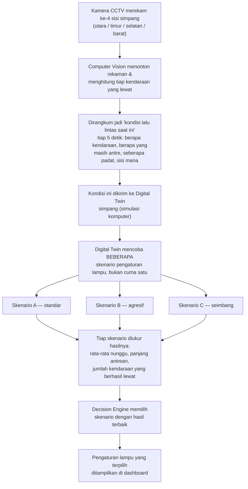
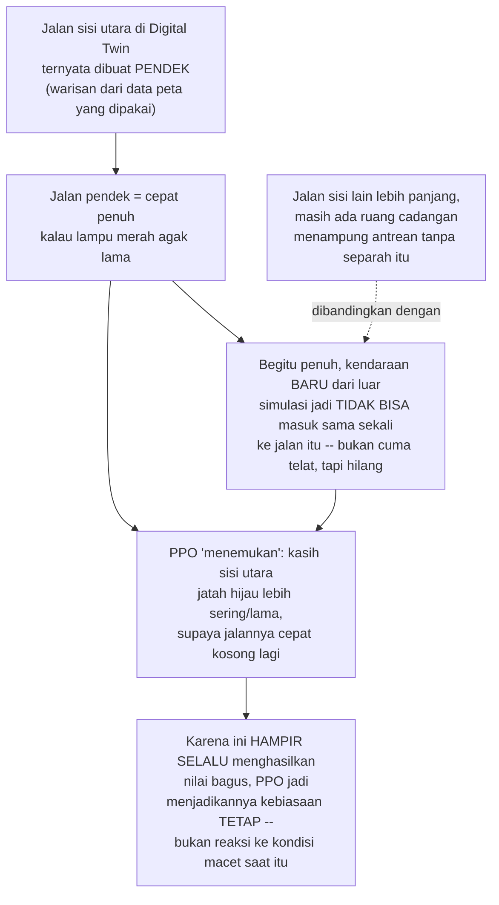

# Alur Kerja Sistem SmartTwin — Penjelasan Ringkas

Dokumen ini untuk memahami **cara kerja sistem dari awal sampai akhir**,
ditulis senormal mungkin (tidak dihindari istilah standarnya, seperti Digital
Twin atau PPO), tapi tanpa nama fungsi/nama file kode. Kalau ada istilah yang
belum jelas, semuanya dijelaskan singkat di **bagian 8 (Istilah)** di paling
bawah. Ini dokumen penjelasan, bukan status tracker — untuk "sudah sampai
mana", baca `STATUS-DAN-SISA-KERJA.md`.

---

## 1. Gambaran besar dalam satu kalimat

Sistem ini **menonton video simpang, menghitung kendaraannya, lalu mencoba
beberapa cara mengatur lampu lalu lintas di Digital Twin simpang itu**
sebelum memutuskan pengaturan mana yang paling bagus dipakai — jadi
keputusannya sudah diuji dulu di simulasi, bukan tebak-tebakan langsung di
jalan asli.

Digital Twin-nya adalah tiruan komputer dari Simpang Pingit, Yogyakarta,
dibuat semirip mungkin dengan aslinya (dari data peta asli), tempat kita bisa
coba-coba pengaturan lampu tanpa mengganggu lalu lintas sungguhan.

---

## 2. Alur keseluruhan (flowchart)

Enam tahap di atas jalan **berulang terus-menerus** selama sistem aktif, bukan
sekali jalan lalu berhenti. Setiap ada kondisi lalu lintas baru, seluruh alur
ini diulang dari awal.

---

## 3. Tahap demi tahap

### Tahap 1 — Kamera merekam

Empat sisi Simpang Pingit direkam. Saat ini pakai **rekaman video**, bukan
siaran langsung dari kamera CCTV Dishub asli (karena tidak ada aksesnya) —
tapi sistemnya sudah dirancang bisa menerima siaran langsung kalau suatu saat
ada aksesnya. Ini pilihan sadar, bukan keterbatasan yang tidak disadari.

### Tahap 2 — Computer Vision menghitung kendaraan dari video

Sistem Computer Vision "menonton" videonya, mendeteksi tiap kendaraan (motor,
mobil, truk, bus), lalu mengikuti pergerakannya sampai melewati sebuah garis
imajiner yang mewakili "sudah masuk simpang". Setiap kendaraan yang melewati
garis itu dihitung ke arah datangnya (utara/timur/selatan/barat).

**Keterbatasan yang sudah diukur dan jujur diakui:** dibandingkan hitungan
manual oleh manusia, akurasinya rata-rata **48,7%** — sistem sering
kehilangan hitungan saat lalu lintas padat (motor berdempetan susah dibedakan
satu sama lain). Ini bukan salah logika programnya, tapi keterbatasan teknik
deteksi pada kepadatan tinggi — sudah diukur langsung, bukan diasumsikan.

### Tahap 3 — Merangkum jadi "kondisi lalu lintas saat ini"

Hitungan mentah kendaraan dirangkum tiap 5 detik menjadi beberapa angka yang
lebih mudah dipakai: berapa kendaraan lewat, berapa yang masih mengantre,
seberapa padat jalannya, dan kira-kira seberapa cepat kendaraan bergerak —
masing-masing untuk keempat sisi simpang secara terpisah.

### Tahap 4 — (Rencananya) meramal kondisi ke depan — belum aktif

Awalnya direncanakan ada tahap tambahan: meramal kondisi lalu lintas 15-30
menit ke depan pakai LSTM, supaya sistem bisa menyiapkan pengaturan lampu
SEBELUM macet terjadi, bukan sesudahnya. Model ramalannya **sudah dilatih dan
hasilnya bagus** di beberapa dataset uji coba, tapi **belum dipakai secara
aktif** di alur kerja utama karena keterbatasan waktu proyek. Sistem saat ini
langsung memakai kondisi lalu lintas TERKINI (tahap 3), bukan hasil ramalan.
Ini bukan kegagalan — modelnya nyata dan terukur — cuma belum tersambung ke
alur produksi.

### Tahap 5 — Mencoba beberapa pengaturan lampu di Digital Twin

Ini bagian intinya. Alih-alih menebak satu pengaturan lampu lalu langsung
dipakai, sistem mencoba **beberapa skenario berbeda** (misalnya: pengaturan
standar, pengaturan yang lebih agresif membubarkan antrean, dan pengaturan
yang lebih seimbang antar keempat sisi) — semuanya dijalankan di Digital
Twin, bukan di simpang asli. Untuk tiap skenario, sistem mengukur:

- Rata-rata berapa lama kendaraan menunggu
- Seberapa panjang antrean yang terbentuk
- Berapa banyak kendaraan yang berhasil lewat simpang

### Tahap 6 — Decision Engine memilih yang terbaik

Dari hasil pengukuran tadi, Decision Engine memilih skenario dengan hasil
paling baik (tunggu paling singkat, antrean paling pendek), lalu itulah yang
direkomendasikan dan ditampilkan di dashboard.

**Ada dua versi Decision Engine yang bisa melakukan pemilihan ini** — ini yang
sering bikin bingung soal PPO, dijelaskan di bagian 4.

---

## 4. Dua versi Decision Engine

### Versi Rule-Based (dipakai sekarang)

Ini seperti resep masakan: **manusia yang menulis aturannya** secara
eksplisit — misalnya "kalau antrean di satu sisi sudah lebih dari 10
kendaraan, kasih hijau lebih lama ke sisi itu". Aturan ini bisa dibaca,
dipahami, dan diprediksi perilakunya oleh siapa saja yang baca kodenya.
**Ini yang dipakai sistem sekarang secara default**, karena perilakunya bisa
dipercaya dan konsisten.

### Versi PPO (ada, sudah dilatih, tapi belum diaktifkan)

Ini beda total. Alih-alih diberi aturan, PPO **mencoba sendiri** berbagai
pengaturan lampu di Digital Twin, puluhan ribu kali berturut-turut, dan tiap
kali dikasih "nilai" — bagus kalau antrean pendek dan kendaraan lancar, buruk
kalau sebaliknya. Lama-lama, PPO "belajar sendiri" pola apa yang cenderung
menghasilkan nilai bagus, tanpa ada manusia yang menuliskan aturannya secara
eksplisit.

Idenya: kalau berhasil, PPO bisa menemukan strategi yang lebih pintar
daripada yang kepikiran manusia. Risikonya: karena dia belajar dari percobaan
di Digital Twin, dia bisa saja belajar hal yang **kebetulan berhasil di
Digital Twin itu secara spesifik**, bukan pemahaman umum tentang lalu lintas
— dan itu persis yang terjadi di sini.

**Sudah dilatih, sudah diuji, dan hasilnya di simulasi memang lebih bagus
dari versi Rule-Based** (antrean & waktu tunggu jauh lebih pendek). Tapi
seperti dijelaskan di bagian 5, ada satu perilaku PPO yang belum bisa
dijelaskan sepenuhnya masuk akal, jadi **belum dijadikan pilihan utama** —
sistem tetap pakai Rule-Based sampai ini lebih dipahami.

---

## 5. Kenapa PPO selalu mengutamakan satu sisi

Ini bagian yang sempat membingungkan. Alur penjelasannya:

Jadi bukan "karena pendek makanya asal dikasih lama" tanpa alasan — ada
rantai sebab-akibat yang masuk akal: **jalan pendek gampang jadi sumbatan
total (bukan cuma macet), dan mengosongkannya lebih sering ternyata secara
konsisten menghasilkan nilai bagus, jadi dijadikan kebiasaan tetap oleh
PPO.**

**Masalahnya:** yang kita inginkan adalah PPO yang membaca kondisi lalu
lintas **saat itu juga** dan bereaksi sesuai kondisi nyata (kalau barat lagi
padat, kasih barat yang lama — bukan selalu utara). Yang terjadi malah PPO
menemukan "kebiasaan aman" dan terus memakainya, bahkan di saat sisi lain
yang sebenarnya jauh lebih padat. Sudah dicoba 4 cara berbeda untuk memaksa
PPO benar-benar membaca kondisi tiap saat, dan semuanya belum berhasil
mengubah kebiasaan itu — detail teknisnya ada di
`docs/audit-bug-ppo-sebelum-training-ke-5.md` kalau suatu saat ingin dibedah
lebih lanjut, tapi kesimpulan praktisnya: **ini diterima sebagai keterbatasan
yang didokumentasikan apa adanya**, bukan disembunyikan.

**Kabar baiknya:** walau kebiasaannya belum sepenuhnya "pintar" seperti yang
diharapkan, saat diuji di simulasi penuh (bukan cuma skenario ekstrem
buatan), PPO **tetap mengalahkan versi Rule-Based** pada hampir semua ukuran
(antrean, waktu tunggu). Kemungkinan besar karena "selalu prioritaskan sisi
yang jalannya pendek" itu sendiri, secara keseluruhan, memang strategi yang
cukup bagus untuk Digital Twin spesifik ini — walau bukan karena alasan yang
kita harapkan (baca kondisi real-time), tapi karena dia berhasil menutupi
kelemahan desain jalan itu secara konsisten.

---

## 6. Kenapa jalan sisi utara di Digital Twin bisa pendek?

Digital Twin-nya dibuat dari **data peta asli** (mengambil bentuk jalan
sungguhan dari peta digital secara otomatis), bukan digambar manual
satu-satu. Proses otomatis ini kadang menghasilkan bentuk jalan yang tidak
persis sama dengan kondisi idealnya — salah satu sisi (utara) hasilnya jauh
lebih pendek dibanding tiga sisi lainnya, dan ini baru ketahuan setelah
diteliti khusus, bukan sesuatu yang sengaja dibuat begitu.

Sudah dipertimbangkan untuk membangun ulang Digital Twin-nya supaya lebih
presisi, tapi berdasarkan arahan pembimbing, itu **tidak wajib** dilakukan —
cukup disimulasikan apa adanya dan keterbatasannya dijelaskan dengan jujur di
laporan, bukan ditutup-tutupi atau diklaim sempurna. Itu yang dilakukan di
seluruh dokumen ini.

---

## 7. Ringkasan status tiap tahap

| Tahap | Status |
|---|---|
| 1. Kamera merekam | ✅ Jalan, pakai rekaman (bukan siaran langsung, tapi bisa) |
| 2. Computer Vision menghitung kendaraan | ⚠️ Jalan, akurasi rata-rata 48,7% — diakui terbuka |
| 3. Merangkum kondisi lalu lintas | ✅ Jalan |
| 4. LSTM meramal kondisi ke depan | ⏸️ Modelnya sudah dilatih & bagus, belum tersambung ke alur utama |
| 5. Coba beberapa skenario di Digital Twin | ✅ Jalan penuh |
| 6a. Decision Engine — Rule-Based (dipakai sekarang) | ✅ Jalan, bisa diandalkan |
| 6b. Decision Engine — PPO (alternatif) | ⚠️ Sudah dilatih, hasilnya bagus di simulasi, tapi kebiasaannya belum sepenuhnya bisa dijelaskan — belum dijadikan pilihan utama |

Untuk detail angka dan bukti teknis di balik setiap baris tabel ini, semuanya
ada di `docs/STATUS-DAN-SISA-KERJA.md` dan dokumen-dokumen "hasil uji" yang
diindeks di `docs/README.md`.

---

## 8. Istilah

- **Digital Twin** — tiruan/kembaran komputer dari Simpang Pingit yang
  sungguhan, dibuat dari data peta asli. Dipakai untuk coba-coba pengaturan
  lampu tanpa mengganggu lalu lintas asli, karena hasilnya bisa diukur dulu
  sebelum benar-benar diterapkan.
- **Computer Vision (CV)** — teknik supaya komputer bisa "melihat" video dan
  mengenali objek di dalamnya, dalam hal ini mendeteksi & menghitung
  kendaraan dari rekaman kamera.
- **PPO** — nama teknik kecerdasan buatan (singkatan dari *Proximal Policy
  Optimization*) yang dipakai di sini. PPO belajar mengatur lampu lewat
  coba-coba berulang-ulang di Digital Twin, bukan diberi aturan tetap oleh
  manusia. Termasuk kategori *reinforcement learning* (belajar dari sistem
  nilai/skor, mirip melatih lewat pujian-dan-koreksi berulang).
  Bukan aturan tetap.
- **Rule-Based Engine** — kebalikan dari PPO: aturan pengaturan lampu yang
  ditulis eksplisit oleh manusia, bukan hasil belajar sendiri. Ini yang
  dipakai sistem sekarang secara default.
- **Decision Engine** — istilah umum untuk "bagian sistem yang memilih
  pengaturan lampu mana yang dipakai". Bisa diisi versi Rule-Based atau versi
  PPO (lihat bagian 4).
- **LSTM** — teknik kecerdasan buatan lain, dipakai untuk meramal kondisi
  lalu lintas beberapa waktu ke depan berdasarkan pola data sebelumnya.
  Berbeda dari PPO — LSTM meramal, PPO memutuskan.
- **Dashboard** — layar/halaman web tempat semua informasi sistem ini
  (kondisi lalu lintas, rekomendasi lampu, hasil pengukuran) ditampilkan ke
  pengguna.
