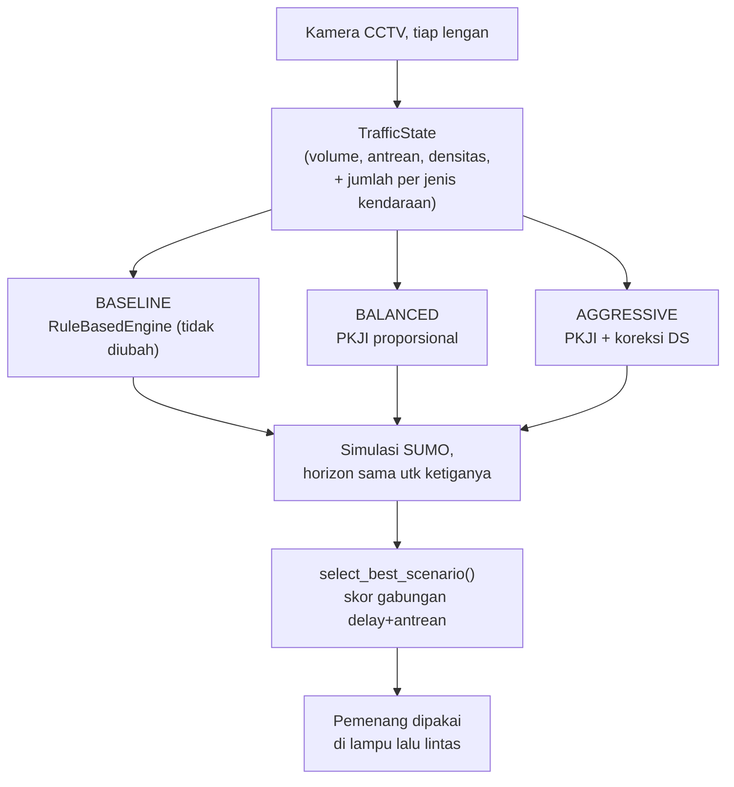

# Cara kandidat baseline, balanced, dan aggressive menghitung nilainya

**Ditambahkan: 7 September 2026.** Dokumen ini menjawab pertanyaan "kok bisa
dapat angka segitu?" untuk ketiga kandidat Scenario Generator, langkah demi
langkah, pakai **satu contoh angka yang sama** dari awal sampai akhir supaya
gampang diikuti.

> ⚠️ **Semua angka di bagian 2-6 dokumen ini adalah ANGKA ILUSTRASI** — dibuat
> sendiri (dipilih supaya bulat dan gampang dihitung tangan), **bukan** hasil
> deteksi CV sungguhan. Tujuannya murni supaya rumusnya kelihatan jelas.
> Untuk angka ASLI dari data CCTV Simpang Pingit (`cv/output/crossing_simpang.csv`)
> dan hasil SUMO sungguhan, baca
> [`hasil-implementasi-pkji-aggressive-balanced.md`](hasil-implementasi-pkji-aggressive-balanced.md)
> bagian 5 & 6 — dokumen itu adalah bukti yang dikutip di laporan teknis,
> dokumen ini **cuma alat bantu belajar rumus**, bukan pengganti bukti.
>
> Semua rumus di bawah sama persis dengan kode di
> `simulation/scenario_generator.py` dan
> `decision_engine/rule_based_engine.py` — tidak ada penyederhanaan.

---

## 0. Ringkasan super singkat

| Kandidat | Rumus dasarnya | Yang dipertimbangkan |
|---|---|---|
| **baseline** | Interpolasi linear dari demand score (`RuleBasedEngine`, tidak diubah) | volume, panjang antrean, densitas — per lengan, independen |
| **balanced** | PKJI 2023 / Webster: bagi hijau **proporsional** ke kepadatan tiap lengan | jumlah kendaraan per JENIS (mobil/motor/bus/truk) diubah ke satuan SMP |
| **aggressive** | balanced **+ koreksi**: lengan yang masih kewalahan (DS > 0,85) ditambah hijau bertahap | sama seperti balanced, plus Degree of Saturation (DS) tiap lengan |

Ketiganya menghasilkan **CyclePlan 4 lengan** (utara→timur→selatan→barat),
lalu ketiganya dijalankan di simulasi SUMO yang sama, dan yang delay+antreannya
paling kecil yang menang (bagian 6).

---

## 1. Gambaran alur



---

## 2. Baseline — `RuleBasedEngine`

Kode: `decision_engine/rule_based_engine.py::calculate_demand_score` &
`calculate_green_time`.

### 2.1 Rumus

Untuk **tiap lengan, independen** (tidak saling memengaruhi):

```
volume_score  = clamp(volume / 30, 0, 1)          # 30 = REFERENCE_VOLUME
queue_score   = clamp(queueLengthVeh / 20, 0, 1)  # 20 = REFERENCE_QUEUE
density_score = clamp(densityIndex / 10, 0, 1)    # 10 = REFERENCE_DENSITY

demand_score  = max(volume_score, queue_score, density_score)   # dibulatkan 2 desimal

green_seconds = 15 + demand_score × (60 − 15)     # MIN..MAX_GREEN_SECONDS
```

Pakai `max`, bukan rata-rata — supaya satu indikator yang ekstrem (misalnya
antrean sudah panjang walau volume biasa saja) tetap membuat lengan itu
diprioritaskan, tidak "ditutupi" oleh dua indikator lain yang rendah.

### 2.2 Contoh angka, dihitung lengkap

Data TrafficState ilustrasi, satu jendela:

| Lengan | volume | queueLengthVeh | densityIndex |
|---|--:|--:|--:|
| Utara | 24 | 10 | 3 |
| Timur | 15 | 10 | 2 |
| Selatan | 8 | 5 | 1 |
| Barat | 2 | 1 | 0 |

**Langkah demi langkah, lengan Utara:**

```
volume_score  = 24/30 = 0,800
queue_score   = 10/20 = 0,500
density_score =  3/10 = 0,300
demand_score  = max(0,800 ; 0,500 ; 0,300) = 0,80

green = 15 + 0,80 × 45 = 15 + 36 = 51 detik
```

**Keempat lengan (rumus sama, tinggal ganti angka):**

| Lengan | volume_score | queue_score | density_score | demand_score | green (detik) |
|---|--:|--:|--:|--:|--:|
| Utara | 0,800 | 0,500 | 0,300 | **0,80** | **51** |
| Timur | 0,500 | 0,500 | 0,200 | **0,50** | **38**¹ |
| Selatan | 0,267 | 0,250 | 0,100 | **0,27** | **27** |
| Barat | 0,067 | 0,050 | 0,000 | **0,07** | **18** |

¹ `15 + 0,50×45 = 37,5` — pas di tengah dua bilangan bulat. Python
membulatkan "setengah ke genap" (`round(37,5)` → **38**, bukan 37), sama
seperti yang dipakai kode di baris `int(round(green))`. Ini bukan salah
ketik — memang begitu perilaku pembulatan bawaan Python.

**Hasil baseline:** Utara 51s / Timur 38s / Selatan 27s / Barat 18s.
Total hijau = 134 detik, + 16 detik kuning (4 lengan × 4 detik) = **siklus
150 detik**.

---

## 3. Balanced — PKJI 2023 (Webster), pembagian proporsional

Kode: `simulation/scenario_generator.py::pkji_cycle_and_green_seconds`.

> **Kenapa datanya beda dari contoh baseline di atas, padahal ini "sama-sama
> kandidat dari TrafficState yang sama"?** Karena PKJI butuh input yang
> baseline tidak butuh (jumlah kendaraan **per jenis**: mobil/motor/bus/truk),
> dan sejak 5 September 2026 pemanggil live (`scenario_worker.py`) memang
> sengaja mengirim rata-rata jendela yang berbeda untuk PKJI dibanding yang
> dipakai baseline — supaya PKJI tidak terlalu sensitif ke satu jendela 5
> detik sesaat (lihat catatan panjang di
> `hasil-implementasi-pkji-aggressive-balanced.md` bagian 5.3). Jadi dua
> angka yang berbeda di sini itu **sesuai desain**, bukan salah sambung data.

### 3.1 Data ilustrasi (jumlah kendaraan per jenis)

| Lengan | Mobil | Motor | Bus | Truk |
|---|--:|--:|--:|--:|
| Utara | 1 | 6 | 0 | 0 |
| Timur | 0 | 5 | 0 | 0 |
| Selatan | 0 | 2 | 0 | 0 |
| Barat | 0 | 1 | 0 | 0 |

### 3.2 Langkah 1 — ubah ke SMP (Satuan Mobil Penumpang)

```
SMP = mobil×1,0 + (bus+truk)×1,3 + motor×0,25     [per jendela 5 detik]
SMP/jam = SMP × (3600/5) = SMP × 720
```

| Lengan | Hitungan | SMP/jendela | SMP/jam |
|---|---|--:|--:|
| Utara | 1×1,0 + 6×0,25 = 1 + 1,5 | 2,50 | **1.800** |
| Timur | 5×0,25 | 1,25 | **900** |
| Selatan | 2×0,25 | 0,50 | **360** |
| Barat | 1×0,25 | 0,25 | **180** |

### 3.3 Langkah 2 — Flow Ratio (FR)

`FR = SMP/jam ÷ S` — `S` (arus jenuh) beda tiap lengan, diambil dari studi
lapangan Simpang Pingit (lihat `hasil-implementasi-pkji-aggressive-balanced.md`
bagian 4.2 untuk sumbernya):

| Lengan | S (smp/jam) | FR = SMP/jam ÷ S |
|---|--:|--:|
| Utara | 5.212,48 | 1.800 ÷ 5.212,48 = **0,3453** |
| Timur | 4.489,81 | 900 ÷ 4.489,81 = **0,2005** |
| Selatan | 3.652,16 | 360 ÷ 3.652,16 = **0,0986** |
| Barat | 3.842,90 | 180 ÷ 3.842,90 = **0,0468** |

**Σ FR (jumlah semua FR) = 0,3453+0,2005+0,0986+0,0468 = 0,6912**

### 3.4 Langkah 3 — waktu siklus optimum (Webster)

```
LTI = 4 lengan × 4 detik kuning = 16 detik
c = (1,5 × LTI + 5) ÷ (1 − Σ FR)
c = (1,5×16 + 5) ÷ (1 − 0,6912)
c = 29 ÷ 0,3088
c ≈ 93,91 detik
```

(Kalau Σ FR ≥ 0,95 — simpang oversaturasi — dijepit ke 0,95 supaya rumus
tidak meledak. Di contoh ini tidak perlu, karena 0,6912 < 0,95.)

### 3.5 Langkah 4 — bagi hijau proporsional ke FR

```
green_budget = c − LTI = 93,91 − 16 = 77,91 detik
g_lengan = (FR_lengan ÷ Σ FR) × green_budget
```

| Lengan | Porsi = FR/ΣFR | Hijau mentah | Dijepit 15–60 | **Hijau balanced** |
|---|--:|--:|--:|--:|
| Utara | 0,3453/0,6912=0,4996 | 0,4996×77,91=38,92 | 39 | **39** |
| Timur | 0,2005/0,6912=0,2900 | 0,2900×77,91=22,59 | 23 | **23** |
| Selatan | 0,0986/0,6912=0,1426 | 0,1426×77,91=11,11 | **di bawah MIN 15** | **15** |
| Barat | 0,0468/0,6912=0,0678 | 0,0678×77,91=5,28 | **di bawah MIN 15** | **15** |

**Hasil balanced:** Utara 39s / Timur 23s / Selatan 15s / Barat 15s.
Total hijau = 92 detik, **siklus = 108 detik** (92 + 16 kuning) — jauh
lebih pendek dari siklus baseline (150 detik), karena baseline tadi
menaksir Utara & Timur butuh hijau jauh lebih besar dari yang sebenarnya
diperlukan menurut kepadatan riilnya.

---

## 4. Aggressive — balanced + koreksi Degree of Saturation (DS)

Kode: `simulation/scenario_generator.py::pkji_apply_ds_correction`.

### 4.1 Rumus DS

```
DS_lengan = SMP/jam ÷ ( S_lengan × (hijau_lengan ÷ siklus_total) )
```

DS > 0,85 (ambang PKJI/MKJI) berarti lengan itu masih "kewalahan" —
kapasitasnya belum cukup untuk arus yang lewat.

### 4.2 Cek DS hasil balanced dulu (siklus = 108 detik)

| Lengan | Hitungan | DS |
|---|---|--:|
| Utara | 1.800 ÷ (5.212,48 × 39/108) = 1.800 ÷ 1.882,15 | **0,96** ❌ di atas 0,85 |
| Timur | 900 ÷ (4.489,81 × 23/108) = 900 ÷ 956,15 | **0,94** ❌ di atas 0,85 |
| Selatan | 360 ÷ (3.652,16 × 15/108) = 360 ÷ 507,25 | **0,71** ✅ aman |
| Barat | 180 ÷ (3.842,90 × 15/108) = 180 ÷ 533,73 | **0,34** ✅ aman |

Utara dan Timur masih di atas ambang → butuh koreksi. Selatan & Barat
sudah aman, tidak disentuh.

### 4.3 Koreksi bertahap (+2 detik/langkah), lengan paling padat duluan

Setiap kali satu lengan ditambah hijau, **siklus totalnya ikut membesar**
(karena hijau lengan itu jadi bagian dari total), jadi DS semua lengan lain
juga ikut sedikit berubah tiap langkah. Ini tabel iterasi lengkap untuk
Utara (dikoreksi lebih dulu karena SMP/jam-nya paling besar):

| Iterasi | Hijau Utara | Siklus total | DS Utara | Masih > 0,85? |
|--:|--:|--:|--:|---|
| 0 (awal) | 39 | 108 | 0,956 | Ya |
| 1 | 41 | 110 | 0,926 | Ya |
| 2 | 43 | 112 | 0,900 | Ya |
| 3 | 45 | 114 | 0,875 | Ya |
| 4 | 47 | 116 | 0,852 | Ya |
| 5 | **49** | 118 | **0,832** | **Tidak, berhenti** |

→ **Hijau Utara final: 49 detik** (5 langkah × 2 detik = +10 dari 39).

Lanjut ke Timur (Utara sudah tetap di 49, siklus mulai dari 118):

| Iterasi | Hijau Timur | Siklus total | DS Timur | Masih > 0,85? |
|--:|--:|--:|--:|---|
| 0 (awal) | 23 | 118 | 1,028 | Ya |
| 1 | 25 | 120 | 0,962 | Ya |
| 2 | 27 | 122 | 0,906 | Ya |
| 3 | 29 | 124 | 0,857 | Ya |
| 4 | **31** | 126 | **0,815** | **Tidak, berhenti** |

→ **Hijau Timur final: 31 detik** (4 langkah × 2 detik = +8 dari 23).

Selatan & Barat: dicek ulang di siklus baru (126 detik) —
DS Selatan = 360÷(3.652,16×15/126) = **0,83** (aman, tidak dikoreksi),
DS Barat = 180÷(3.842,90×15/126) = **0,39** (aman, tidak dikoreksi).

### 4.4 Hasil aggressive

| Lengan | Hijau balanced | Hijau **aggressive** | DS akhir (siklus final 126s) |
|---|--:|--:|--:|
| Utara | 39 | **49** | 0,888 |
| Timur | 23 | **31** | 0,815 |
| Selatan | 15 | **15** | 0,828 |
| Barat | 15 | **15** | 0,393 |

Total hijau = 110 detik, **siklus = 126 detik**.

> ⚠️ **Catatan jujur, penting:** perhatikan DS akhir Utara di tabel di atas
> adalah **0,888 — di atas ambang 0,85 lagi**, padahal saat koreksinya
> berhenti (iterasi 5, bagian 4.3) DS Utara sempat turun ke 0,832 (aman).
> Ini bukan bug — penyebabnya: setelah Utara "lulus", Timur ikut dikoreksi
> dan siklus totalnya membesar lagi (118 → 126 detik). Siklus yang lebih
> besar berarti **porsi hijau Utara terhadap siklus mengecil lagi**, jadi
> DS-nya naik lagi. Algoritmenya **tidak mengecek ulang lengan yang sudah
> "lulus"** setelah lengan lain dikoreksi — keterbatasan yang sama persis
> ditemukan di lengan Barat pada data CV asli, lihat
> `hasil-implementasi-pkji-aggressive-balanced.md` bagian 5.2.

---

## 5. Ringkasan ketiga kandidat, contoh ini

| Lengan | Baseline | Balanced | Aggressive |
|---|--:|--:|--:|
| Utara | 51 | 39 | 49 |
| Timur | 38 | 23 | 31 |
| Selatan | 27 | 15 | 15 |
| Barat | 18 | 15 | 15 |
| **Total hijau** | **134** | **92** | **110** |
| **Siklus (+16s kuning)** | **150** | **108** | **126** |

Pola yang kelihatan di sini (dan konsisten dengan temuan data asli di
`hasil-implementasi-pkji-aggressive-balanced.md` bagian 6): **baseline
cenderung menaksir kebutuhan hijau terlalu besar** (rumus linear
`RuleBasedEngine` tidak tahu kapasitas jalan sungguhan), sehingga
siklusnya paling panjang. **Balanced paling ramping** (proporsional murni,
tanpa jaminan tidak ada lengan yang kewalahan). **Aggressive** ada di
tengah — sedikit lebih panjang dari balanced karena secara sengaja
"mengorbankan" durasi siklus demi menurunkan DS lengan yang macet.

---

## 6. Cara pemenang dipilih — `select_best_scenario()`

Kode: `simulation/scenario_generator.py::select_best_scenario`.

Ketiga CyclePlan di atas **dijalankan di SUMO** pada horizon simulasi yang
sama, menghasilkan `avgDelaySeconds` dan `avgQueueLengthM` nyata. Baru dari
situ dipilih pemenangnya:

```
delayNorm  = avgDelaySeconds  ÷ delay_terburuk_di_3_kandidat
queueNorm  = avgQueueLengthM  ÷ antrean_terburuk_di_3_kandidat
skor       = 0,5 × delayNorm + 0,5 × queueNorm

Kandidat dengan skor PALING RENDAH yang menang.
```

Dinormalisasi ke nilai **terburuk di batch itu sendiri** (bukan skala
absolut) supaya delay (detik) dan antrean (meter) — dua satuan berbeda —
bisa digabung adil. Bobot 50/50 adalah keputusan tim (heuristik proyek),
bukan angka baku dari standar manapun.

### Contoh angka (ilustrasi — bukan hasil SUMO sungguhan)

| Kandidat | avgDelaySeconds | avgQueueLengthM |
|---|--:|--:|
| baseline | 20,0 | 42,0 |
| balanced | 13,0 | 28,0 |
| aggressive | 15,0 | 30,0 |

`delay_terburuk = 20,0`, `queue_terburuk = 42,0`.

```
skor_baseline   = 0,5×(20,0/20,0) + 0,5×(42,0/42,0) = 0,5×1,000 + 0,5×1,000 = 1,000
skor_balanced   = 0,5×(13,0/20,0) + 0,5×(28,0/42,0) = 0,5×0,650 + 0,5×0,667 = 0,658
skor_aggressive = 0,5×(15,0/20,0) + 0,5×(30,0/42,0) = 0,5×0,750 + 0,5×0,714 = 0,732
```

**Skor paling rendah: balanced (0,658) → balanced menang.**

---

## 7. Bukti nyata (bukan ilustrasi) — hasil SUMO sungguhan

Angka di bagian 2-6 di atas murni buat belajar rumus. Untuk hasil yang
BENAR-BENAR dijalankan lewat SUMO (bukan ilustrasi), lihat
`hasil-implementasi-pkji-aggressive-balanced.md` bagian 6:

| Kandidat | Hijau U/T/S/B | Siklus | Delay | LOS |
|---|---|--:|--:|---|
| baseline | 60/26/22/20 | 144s | 21,42s | C |
| **balanced** | 27/20/15/15 | 93s | 13,32s | **B** |
| aggressive | 33/26/15/15 | 105s | 16,00s | B |

Pemenang di run itu: **balanced**. Pola yang sama seperti contoh ilustrasi
di bagian 6 di atas — balanced menang karena siklusnya paling ramping,
jadi kendaraan tidak menunggu selama itu untuk gilirannya.

---

## 8. Batasan yang harus disebut jujur (ringkas)

Detail lengkap ada di `hasil-implementasi-pkji-aggressive-balanced.md`
bagian 4 & 5.3 — ringkasannya:

- **Data arus jenuh (S)** berasal dari studi lapangan Simpang Pingit tahun
  **2016** (≈10 tahun lalu), bukan pengukuran ulang tim SmartTwin di 2026.
- **Ekstrapolasi jendela 5 detik × 720 sangat sensitif** — 1 kendaraan
  tambahan di satu jendela = +720 smp/jam dalam perkiraan. Untuk jendela
  yang kebetulan sangat sibuk, ini bisa membuat semua lengan mentok ke
  batas MAX_GREEN_SECONDS (lihat "Temuan jujur" di dokumen bukti, bagian 5.3).
- **DS bisa naik lagi setelah "lulus"** — lihat catatan jujur di bagian 4.4
  dokumen ini, gejala yang sama ditemukan juga di data CV asli.
- **Baseline sengaja tidak dihitung ulang pakai PKJI** — supaya tetap jadi
  pembanding "sebelum dioptimasi" yang stabil di halaman Riwayat.

---

## 9. Rujukan kode

| Bagian | File | Fungsi |
|---|---|---|
| Baseline (demand score, green time) | `decision_engine/rule_based_engine.py` | `calculate_demand_score`, `calculate_green_time`, `recommend_cycle` |
| Konversi SMP, Flow Ratio, siklus, pembagian proporsional | `simulation/scenario_generator.py` | `pkji_flow_smp_per_hour`, `pkji_cycle_and_green_seconds` |
| Degree of Saturation & koreksi aggressive | `simulation/scenario_generator.py` | `pkji_degree_of_saturation`, `pkji_apply_ds_correction` |
| Menyusun 3 kandidat CyclePlan | `simulation/scenario_generator.py` | `generate_cycle_candidate_plans` |
| Menjalankan tiap kandidat di SUMO | `simulation/scenario_generator.py` | `simulate_cycle_candidate` |
| Memilih pemenang | `simulation/scenario_generator.py` | `select_best_scenario` |
| Orkestrator (menyatukan semua di atas) | `simulation/scenario_generator.py` | `ScenarioEngine.recommend_full_cycle` |
