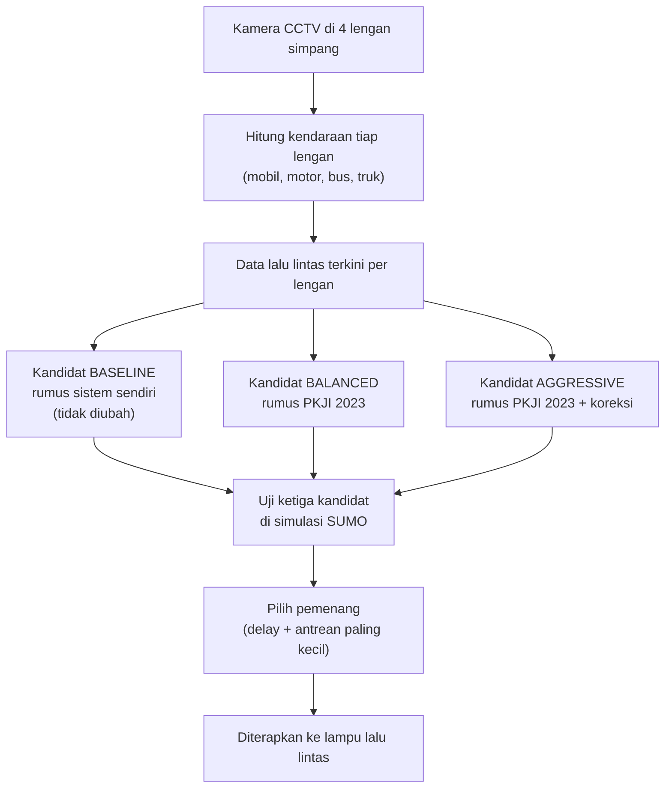
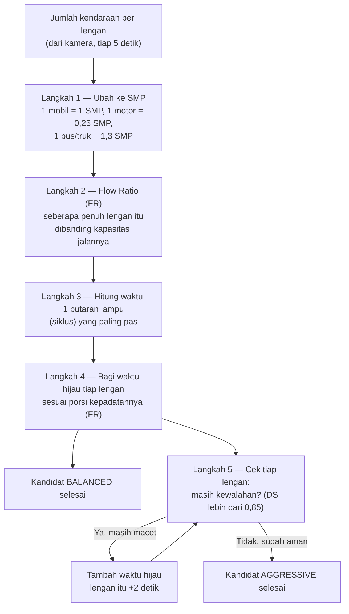

# Implementasi PKJI 2023 untuk kandidat "aggressive" & "balanced"

**Ditambahkan: 5 September 2026.** Menjawab kebutuhan proposal: sistem
menerapkan **PKJI 2023** (Pedoman Kapasitas Jalan Indonesia, penerus MKJI
1997) sebagai landasan pembagian waktu hijau, bukan cuma tempelan angka.

> Catatan: audit lama (`audit_final_31agustus.md`, 31 Agustus) menulis
> "Validasi PKJI 2023 — TIDAK PERNAH ADA sebagai studi formal". Itu benar
> **untuk saat itu**. Dokumen ini menggantikan kesimpulan itu — jangan
> kutip audit lama sebagai status terkini soal PKJI.

---

## 0. Alur sistem sekarang (gambar)

Ini gambaran besarnya dulu, sebelum masuk ke rumus. Baca kotaknya dari
atas ke bawah — tiap panah artinya "lanjut ke langkah berikutnya".



**Cara bacanya, langkah demi langkah:**

1. **Kamera menghitung kendaraan** di tiap lengan simpang — berapa
   mobil, motor, bus, truk yang lewat.
2. Dari data itu, sistem membuat **3 usulan** ("kandidat") pengaturan
   lampu berbeda:
   - **Baseline** — usulan dari rumus sistem sendiri (rumus lama, tetap
     dipakai sebagai pembanding, tidak disentuh sama sekali)
   - **Balanced** — usulan baru, dihitung pakai **rumus PKJI 2023**
   - **Aggressive** — usulan baru juga, dihitung pakai **rumus PKJI
     2023 + satu langkah koreksi tambahan**
3. **Ketiga usulan itu dicoba di simulasi SUMO** (simulasi lalu lintas
   komputer) untuk melihat mana yang hasilnya paling bagus (antrean dan
   waktu tunggu paling kecil).
4. **Yang paling bagus dipakai** untuk mengatur lampu lalu lintas
   sungguhan.

Jadi PKJI itu **bukan menggantikan seluruh sistem** — PKJI cuma dipakai
untuk menghitung **2 dari 3 usulan** (balanced & aggressive). Baseline
tetap ada supaya ada pembanding "kalau sistem tidak melakukan apa-apa".

---

## 1. Apa yang berubah, apa yang tidak

| Kandidat | Sebelum | Sekarang |
|---|---|---|
| **baseline** | Rumus `RuleBasedEngine` (interpolasi linear dari demand score) | **Tidak berubah** — lihat alasan di bagian 2 |
| **aggressive** | "+1 detik ke lengan tersibuk" (angka dari uji coba manual, bukan rumus) | **Rumus PKJI 2023** + koreksi Degree of Saturation (DS) |
| **balanced** | "Rata-rata ditarik ke minimum" (heuristik, bukan rumus) | **Rumus PKJI 2023** (pembagian proporsional Flow Ratio) |

**File yang diubah:** `simulation/scenario_generator.py` (rumus PKJI + `generate_cycle_candidate_plans()`), disambungkan lewat `backend/app/services/simulation_service.py` dan `backend/app/api/routes/digital_twin.py`.

### 1.1 Laporan: aggressive LAMA vs aggressive SEKARANG

**Ringkasan satu kalimat:** dulu aggressive cuma **menempel +1 detik ke
satu lengan tersibuk** dan membiarkan 3 lengan lain persis sama seperti
baseline; sekarang aggressive **menghitung ulang keempat lengan dari
nol** pakai rumus PKJI, lalu mengoreksi lengan mana pun yang masih
kewalahan — bukan cuma yang tersibuk.

| | Aggressive LAMA | Aggressive SEKARANG |
|---|---|---|
| **Rumusnya** | `hijau_tersibuk = hijau_baseline + 1 detik` | 5 langkah PKJI 2023 (SMP → Flow Ratio → siklus optimum → bagi proporsional → koreksi DS) |
| **Dari mana angka "+1 detik"-nya?** | Uji coba manual di SUMO — dicoba +20%, macet makin parah, dicoba beberapa nilai lain, +1 detik yang paling kecil kerugiannya. **Bukan dari rumus**, dari trial-and-error | Angka `emp` (1,0/1,3/0,25), ambang DS 0,85, rumus siklus Webster — semua nilai baku rekayasa lalu lintas Indonesia |
| **Lengan mana yang dihitung ulang?** | **Cuma 1** — lengan yang paling padat (`busiestApproach`) | **Bisa sampai 4** — semua lengan dihitung ulang proporsional, lalu semua yang DS-nya masih di atas 0,85 dikoreksi (bukan cuma yang paling padat) |
| **Lengan yang sepi diapakan?** | Dibiarkan **persis sama** seperti baseline, tidak disentuh sama sekali | Ikut dihitung ulang proporsional — bisa naik, bisa juga tetap kecil kalau memang sepi |
| **Bisa dijelaskan "kenapa segini"?** | Tidak — angkanya hasil coba-coba, tidak ada rumus untuk ditunjukkan | Ya — tiap detik bisa ditelusuri balik ke rumus PKJI + data kendaraan aslinya (lihat bagian 5) |
| **Landasan buat juri** | Tidak ada — kalau ditanya "kenapa +1 detik bukan +2 atau +5", jawabannya cuma "hasil coba-coba" | Ada — PKJI 2023, standar resmi Indonesia untuk simpang bersinyal |

**Contoh angka nyata, kondisi SUMO yang sama** (dari bukti bagian 6 —
baseline: Utara 60 / Timur 26 / Selatan 22 / Barat 20 detik, Utara
adalah lengan tersibuk **dan sudah mentok `MAX_GREEN_SECONDS`**):

| Lengan | Baseline | Aggressive **LAMA** | Aggressive **SEKARANG** |
|---|--:|--:|--:|
| Utara (tersibuk) | 60 | 60 *(+1 detik, tapi sudah mentok 60 → tidak berubah)* | 34 |
| Timur | 26 | 26 *(tidak disentuh)* | 25 |
| Selatan | 22 | 22 *(tidak disentuh)* | 15 |
| Barat | 20 | 20 *(tidak disentuh)* | 15 |

**Yang paling kelihatan bedanya di contoh ini:** aggressive lama **sama
persis dengan baseline, TIDAK melakukan apa-apa** — Utara sudah di
batas maksimum sebelum "+1 detik" dicoba, jadi tidak ada efeknya sama
sekali. Aggressive sekarang **menghitung ulang total dari nol**: Utara
justru **turun** dari 60 ke 34 detik (rumus RuleBasedEngine lama
menebak Utara butuh hijau maksimum, tapi Flow Ratio sungguhan dari
data kendaraan bilang tidak sebesar itu), dan siklus totalnya jadi jauh
lebih pendek (144 detik → 105 detik). Ini bukan cuma beda kandidatnya —
**hasilnya juga lebih baik**: diuji SUMO, delay turun dari 21,42 detik
(LOS C) jadi 16,07 detik (LOS B). Detail lengkap di bagian 6.

### 1.2 Kelebihan & kekurangan masing-masing

**Aggressive lama:**
- ✅ Sederhana, gampang dijelaskan langkahnya
- ✅ Perubahannya kecil → risiko rendah, tidak akan bikin simpang lain jadi kacau
- ❌ Tidak ada dasar teori — kalau ditanya "kenapa 1 detik", jawabannya cuma "hasil coba-coba di SUMO"
- ❌ 3 dari 4 lengan tidak pernah ikut dipertimbangkan sama sekali

**Aggressive sekarang (PKJI):**
- ✅ Ada rumus & standar resmi yang bisa ditunjuk kalau ditanya
- ✅ Semua lengan ikut dipertimbangkan, bukan cuma yang paling padat
- ✅ Ada bukti bisa ditelusuri ke angka kendaraan asli (bagian 5)
- ✅ Lebar lengan sekarang pakai **data survei asli** Simpang Pingit (bagian 4), bukan lagi angka asumsi tim
- ❌ Perubahannya jauh lebih besar dari sebelumnya (kandidat yang padat masih bisa mentok ke batas atas/bawah — lihat temuan bagian 5.3), jadi butuh diuji SUMO dengan hati-hati sebelum dipakai beneran, tidak sekadar "pasti lebih baik karena rumusnya resmi"
- ❌ Satu-satunya bagian yang masih asumsi: faktor penyesuaian lanjutan PKJI (FCS/FSF/FG/FP/FRT/FLT) — lihat bagian 4

## 2. Kenapa baseline TIDAK ikut diubah

`baseline` dipakai di banyak tempat sebagai **pembanding "sebelum
dioptimasi"** — kartu Before/After di halaman Riwayat, badge menang/kalah
skenario, dll (lihat `BASELINE_CANDIDATE_ID` di `backend/app/services/history_service.py`). Kalau baseline ikut dihitung ulang pakai PKJI, tidak ada lagi apa yang mau dibandingkan — makna "seberapa besar sistem membantu" hilang.

Baseline sendiri **juga bukan rumus resmi apa pun** — itu rumus linear
sederhana buatan tim (`decision_engine/rule_based_engine.py::calculate_green_time`). Tidak diklaim sebagai PKJI di tempat manapun.

## 3. Rumus yang dipakai

Ini gambar alur 5 langkahnya. Detail rumus tiap langkah ada di bawah
gambar — tidak perlu dihafal semua sekaligus, cukup ikuti urutannya.



**Penjelasan super simpel tiap kotak:**

- **Langkah 1 (ubah ke SMP):** motor, mobil, bus, dan truk ukurannya
  beda-beda dan makan tempat di jalan berbeda-beda juga. Supaya bisa
  dibandingkan adil, semua diubah jadi satu satuan yang sama, namanya
  SMP (anggap saja "setara berapa mobil").
- **Langkah 2 (Flow Ratio):** membandingkan "seberapa banyak kendaraan
  yang mau lewat" dengan "seberapa banyak yang muat ditampung jalan
  itu". Kalau angkanya mendekati 1, artinya lengan itu hampir/sudah
  penuh.
- **Langkah 3 (waktu 1 putaran lampu):** ini menentukan berapa detik
  total satu putaran lampu (utara→timur→selatan→barat→ulang lagi),
  dihitung supaya totalnya paling efisien untuk kondisi saat ini.
- **Langkah 4 (bagi waktu hijau):** lengan yang lebih padat (Flow Ratio
  lebih besar) dapat jatah hijau lebih lama, secara proporsional. Di
  sinilah kandidat **balanced** selesai dihitung.
- **Langkah 5 (cek & tambah, khusus aggressive):** setelah dibagi
  proporsional, dicek lagi satu-satu — ada lengan yang masih kewalahan
  tidak? Kalau ada, ditambah beberapa detik lagi, diulang ceknya, sampai
  aman atau sampai mentok batas maksimum. Ini yang membuat kandidat
  **aggressive** beda dari **balanced**.

### Langkah 1 — Konversi ke SMP (Satuan Mobil Penumpang)

Setiap jenis kendaraan dikali faktor ekivalensi (emp) standar untuk
simpang bersinyal 4-lengan:

| Jenis | emp |
|---|---:|
| Mobil (LV) | 1,0 |
| Bus + truk (HV) | 1,3 |
| Motor (MC) | 0,25 |

```
Q_smp = mobil×1,0 + (bus+truk)×1,3 + motor×0,25   [per jendela 5 detik]
Q_smp/jam = Q_smp × (3600 / 5)
```

### Langkah 2 — Flow Ratio (FR)

```
FR = Q_smp/jam ÷ S
```

`S` = arus jenuh (kapasitas dasar lengan), **beda tiap lengan** karena
kondisi jalannya beda. **Diambil langsung dari hasil studi lapangan
Simpang Pingit** (bukan dihitung sendiri dari `S0 = 600 × We` — lihat
bagian 4 untuk penjelasan lengkap & sumbernya):

| Lengan | S — arus jenuh (smp/jam) |
|---|--:|
| Utara (Jl. Magelang) | 5.212,48 |
| Timur (Jl. Diponegoro) | 4.489,81 |
| Selatan (Jl. AM. Sangaji) | 3.652,16 |
| Barat (Jl. Kyai Mojo) | 3.842,90 |

### Langkah 3 — Waktu siklus optimum (metode Webster, dipakai PKJI)

```
c = (1,5 × LTI + 5) ÷ (1 − Σ FR)
```

`LTI` = total lost time (4 lengan × 4 detik kuning = 16 detik, konstanta
`YELLOW_SECONDS` yang sudah dipakai di seluruh proyek ini).

Kalau Σ FR ≥ 0,95 (simpang oversaturasi, penyebut mendekati/di bawah
nol), dijepit ke 0,95 — ini **pengaman**, bukan bagian rumus PKJI baku.
Didokumentasikan eksplisit di kode (`scenario_generator.py`).

### Langkah 4 — Pembagian hijau proporsional → kandidat **"balanced"**

```
g_lengan = (FR_lengan ÷ Σ FR) × (c − LTI)
```

Dijepit ke `MIN_GREEN_SECONDS..MAX_GREEN_SECONDS` (15–60 detik) — itu
batas operasional TLS di proyek ini, bukan bagian rumus PKJI.

> Catatan teknis: `Σ FR` di **bagian ini** (pembagi porsi tiap lengan)
> memakai jumlah FR **asli** (belum dijepit 0,95) — beda dari `Σ FR` di
> Langkah 3 (dipakai menghitung `c`) yang **sudah** dijepit. Kalau
> keduanya dijepit, porsi antar-lengan jadi tidak sepenuhnya
> proporsional lagi terhadap kepadatan sebenarnya. Contoh angka
> lengkapnya ada di bagian 5.

### Langkah 5 — Koreksi Degree of Saturation → kandidat **"aggressive"**

```
DS_lengan = Q_smp/jam ÷ (S × g_lengan/c)
```

PKJI/MKJI menetapkan **DS ≤ 0,85** sebagai ambang kinerja simpang yang
masih dapat diterima. Lengan dengan DS > 0,85 diberi tambahan hijau
bertahap (2 detik/langkah) sampai DS turun ke ambang, atau mentok
`MAX_GREEN_SECONDS`. Lengan paling jenuh dikoreksi lebih dulu.

## 4. Asumsi yang harus disebutkan jujur kalau ditanya juri

> **Diperbarui 5 September 2026.** Sebelumnya bagian ini bilang lebar
> jalan cuma asumsi tim (`We = 6,0 meter` rata untuk semua lengan).
> **Sekarang diganti data survei lapangan asli** Simpang Pingit, per
> lengan (bukan lagi satu angka rata). Ini mengurangi satu-satunya
> asumsi terbesar di seluruh implementasi PKJI ini.

### 4.1 Lebar efektif pendekat (We) — sekarang data survei, bukan asumsi

| Lengan | We (meter) | Sumber |
|---|--:|---|
| Utara (Jl. Magelang) | 8,2 | Survei lapangan Simpang Pingit |
| Timur (Jl. Diponegoro) | 7,6 | Survei lapangan Simpang Pingit |
| Selatan (Jl. AM. Sangaji) | 7,0 | Survei lapangan Simpang Pingit |
| Barat (Jl. Kyai Mojo) | 7,5 | Survei lapangan Simpang Pingit |

**Sumber data:** jurnal Renovasi, Universitas Sarjanawiyata Tamansiswa
(`jurnal.ustjogja.ac.id/index.php/renovasi`, artikel id 1804).

> ⚠️ **Penting — batas kejujuran sumber ini:** angka di atas
> ditranskrip dari yang diberikan pengguna (5 September 2026), **bukan
> dibaca langsung oleh tim** dari PDF aslinya. Tim mencoba mengakses
> PDF-nya 3 kali (link jurnal & link Academia.edu di bawah), **semuanya
> balik `403 Forbidden`** — kemungkinan diblokir bot atau butuh login.
> **Sebelum dikutip di laporan/proposal resmi, cek ulang sendiri ke
> PDF asli** untuk memastikan angka & judul papernya benar. Ini bukan
> alasan untuk tidak memakainya — datanya jauh lebih baik dari asumsi
> 6 meter kemarin — tapi kejujuran soal provenance-nya harus tetap
> disebutkan.

### 4.2 Data pembanding tambahan (belum dipakai di rumus, cuma referensi)

Pengguna juga memberikan tabel kinerja simpang dari sumber kedua
(academia.edu/144251112, "Analisa Kinerja Simpang Bersinyal Pingit
Yogyakarta", jam puncak pagi — akses PDF juga 403, sama seperti di
atas):

| Lengan | Kapasitas (smp/jam) | DS | Keterangan (dari sumber) |
|---|--:|--:|---|
| Utara | 1.417 | 0,895 | Lewat jenuh / butuh pelebaran |
| Timur | 1.017 | 0,943 | Sangat jenuh / pemicu antrean utama |
| Selatan | 764 | 0,783 | Cukup stabil |
| Barat | 803 | 0,683 | Kondisi arus relatif aman |

**Kenapa angka ini TIDAK langsung dimasukkan ke rumus:** kolom
"Kapasitas" di tabel itu **bukan** arus jenuh (S) yang dipakai rumus
`FR = Q/S` — itu **kapasitas** (`C = S × hijau/siklus`, sudah
memperhitungkan waktu hijau yang dipakai simpang PADA SAAT studi itu
dilakukan). Memasukkannya langsung ke slot `S` di kode ini akan salah
satuan (dihitung dua kali dikurangi rasio hijau/siklus). **Dipakai
sebagai referensi/pembanding di laporan saja** — dan kebetulan **cocok
arahnya** dengan hasil model kami sendiri: Utara dan Timur sama-sama
muncul sebagai lengan paling jenuh, baik di studi akademik ini maupun
di hitungan PKJI kami (lihat bagian 5) — walau angka persisnya beda
karena beda metodologi & waktu pengambilan data.

### 4.3 Yang masih murni asumsi (satu-satunya yang tersisa)

**Faktor penyesuaian lanjutan PKJI diasumsikan 1,0** (tidak
diterapkan): `FCS` (ukuran kota), `FSF` (gesekan samping), `FG`
(kelandaian), `FP` (parkir), `FRT`/`FLT` (belok kanan/kiri) — masing-
masing butuh survei kondisi jalan tambahan yang di luar scope 16 hari
proyek ini.

Semua konstanta lain (emp, ambang DS 0,85, rumus `S0=600×We`, rumus
siklus Webster) adalah **nilai baku PKJI/MKJI** yang lazim dipakai di
praktik rekayasa lalu lintas Indonesia — bukan buatan tim.

## 5. Perhitungan manual, langkah demi langkah, data CV asli

Bagian ini isinya hitungan tangan, bukan cuma rumus — **memakai data
kamera sungguhan**, bukan angka karangan. Sumbernya:
`cv/output/crossing_simpang.csv`, baris asli hasil deteksi CCTV Simpang
Pingit, 15 Agustus 2026. Setiap angka di bawah bisa dicek ulang langsung
ke file CSV itu.

### 5.1 Contoh 1 — jendela sibuk, `16:58:20`

**Data mentah** (1 jendela = 5 detik, apa adanya dari kamera):

| Lengan | Mobil | Motor | Bus | Truk | Total |
|---|--:|--:|--:|--:|--:|
| Utara (kamera MAGELANG) | 0 | 6 | 1 | 0 | 7 |
| Timur (kamera DIPONEGORO) | 1 | 4 | 1 | 0 | 6 |
| Selatan (CCTV_1) | 0 | 0 | 0 | 0 | 0 |
| Barat (CCTV_3) | 0 | 3 | 0 | 3 | 6 |

**Langkah 1 — ke SMP.** Rumus: `mobil×1,0 + (bus+truk)×1,3 + motor×0,25`, lalu dikali `3600/5 = 720` untuk jadi per jam.

```
Utara   : 0×1,0 + 1×1,3 + 6×0,25 = 0 + 1,3 + 1,5  = 2,80 smp  → ×720 = 2.016 smp/jam
Timur   : 1×1,0 + 1×1,3 + 4×0,25 = 1 + 1,3 + 1,0  = 3,30 smp  → ×720 = 2.376 smp/jam
Selatan : tidak ada kendaraan sama sekali           = 0,00 smp  → ×720 =     0 smp/jam
Barat   : 0×1,0 + 3×1,3 + 3×0,25 = 0 + 3,9 + 0,75 = 4,65 smp  → ×720 = 3.348 smp/jam
```

**Langkah 2 — Flow Ratio.** `S` sekarang beda tiap lengan (data survei
asli, bagian 4.1): Utara 4.920, Timur 4.560, Selatan 4.200, Barat 4.500
smp/jam.

```
FR utara   = 2.016 / 4.920 = 0,41
FR timur   = 2.376 / 4.560 = 0,52
FR selatan =     0 / 4.200 = 0,00
FR barat   = 3.348 / 4.500 = 0,74
------------------------------------
Σ FR (asli, belum dijepit) = 0,41+0,52+0+0,74 = 1,67
```

⚠️ **Σ FR = 1,67, masih di atas 1** — lebih rendah dari sebelumnya
(dulu 2,15 dengan asumsi lebar rata 6 meter), karena jalan Simpang
Pingit ternyata lebih lebar dari asumsi lama, jadi kapasitasnya lebih
besar. Tapi jendela 5 detik ini memang jendela yang SANGAT sibuk (lihat
data mentah di atas) — jadi tetap oversaturasi kalau diekstrapolasi
jadi laju per jam. Lihat kotak "Temuan penting" di bagian 5.3.

**Langkah 3 — waktu siklus.** Σ FR dijepit ke 0,95 (di atas ambang aman):

```
LTI = 4 lengan × 4 detik kuning = 16 detik
c = (1,5×16 + 5) / (1 − 0,95) = 29 / 0,05 = 580 detik  (≈9 menit 40 detik)
```

**Langkah 4 — bagi hijau proporsional (balanced).** Porsi tiap lengan
memakai Σ FR **asli** (1,67), bukan yang dijepit (0,95) — lihat catatan
teknis di Langkah 4 bagian 3.

```
green_budget = 580 − 16 = 564 detik

porsi utara   = 0,41 / 1,67 = 0,245  → hijau = 0,245×564 = 138 dtk → dijepit MAX 60 dtk
porsi timur   = 0,52 / 1,67 = 0,311  → hijau = 0,311×564 = 176 dtk → dijepit MAX 60 dtk
porsi selatan = 0,00 / 1,67 = 0,000  → hijau = 0×564     =   0 dtk → dijepit MIN 15 dtk
porsi barat   = 0,74 / 1,67 = 0,444  → hijau = 0,444×564 = 251 dtk → dijepit MAX 60 dtk
```

→ **Kandidat balanced: Utara 60 / Timur 60 / Selatan 15 / Barat 60 detik**
— hasilnya sama persis mentoknya seperti sebelum lebar asli dipakai
(jendela ini memang genuinely sangat sibuk), tapi lihat Langkah 5 --
DS-nya sekarang lebih rendah, artinya kondisinya sedikit tidak separah
yang dikira asumsi lama.
Siklus aktual (dari hijau yang SUDAH dijepit) = 60+60+15+60+16 = **211 detik.**

**Langkah 5 — cek DS (aggressive).** `DS = smp/jam ÷ (S_lengan × hijau/siklus)`, siklus = 211 detik dari Langkah 4:

```
DS utara   = 2.016 / (4.920 × 60/211) = 2.016 / 1.399,1 = 1,44
DS timur   = 2.376 / (4.560 × 60/211) = 2.376 / 1.297,0 = 1,83
DS selatan =     0 / (4.200 × 15/211) = 0,00
DS barat   = 3.348 / (4.500 × 60/211) = 3.348 / 1.279,6 = 2,62
```

Turun dari perkiraan lama (1,97 / 2,32 / — / 3,27) karena jalannya
memang lebih lebar dari asumsi — tapi **masih jauh di atas ambang
0,85**. Utara, timur, barat harusnya dikoreksi (ditambah hijau).
**Tapi ketiganya sudah mentok `MAX_GREEN_SECONDS = 60 detik`** sebelum
koreksi sempat jalan, jadi koreksi tidak bisa berbuat apa-apa lagi.
Hasilnya:

→ **Kandidat aggressive: SAMA PERSIS dengan balanced (60/60/15/60)** —
bukan karena rumusnya salah, tapi karena batas 60 detik sistem sudah
tercapai duluan. Jendela 5 detik ini memang jendela paling sibuk yang
ditemukan di seluruh 538 jendela data (lihat bagian 5.2 untuk contoh
yang lebih tenang, yang JUSTRU membuktikan rumusnya bekerja normal
kalau kondisinya tidak seekstrem ini).

*(Angka di atas dicocokkan langsung ke keluaran kode
`pkji_cycle_and_green_seconds()`/`pkji_apply_ds_correction()` — bukan
cuma hitung manual terpisah, hasilnya identik.)*

### 5.2 Contoh 2 — jendela lebih tenang, `16:36:15`, untuk pembanding

Data mentah: Utara 1 mobil+1 motor, Timur 1 mobil, Selatan kosong, Barat
2 mobil+1 motor. Jendela ini **di bawah rata-rata** (rata-rata 538
jendela di file CSV ini adalah ~8,3 kendaraan/jendela gabungan 4 lengan;
jendela ini cuma 6).

| | Utara | Timur | Selatan | Barat |
|---|--:|--:|--:|--:|
| smp/jam | 900 | 720 | 0 | 1.620 |
| Flow Ratio | 0,183 | 0,158 | 0,000 | 0,360 |
| **Hijau balanced (dtk)** | **21** | **18** | **15** | **42** |
| DS balanced | 0,98 | 0,98 | 0,00 | 0,96 |
| **Hijau aggressive (dtk)** | **29** | **26** | **15** | **52** |
| DS aggressive | 0,87 | 0,84 | 0,00 | 0,96 |

**Ini yang berubah paling banyak sejak pakai lebar jalan asli.** Dulu
(asumsi 6 meter rata) jendela ini JUGA mentok semua ke 60 detik, sama
kayak Contoh 1. **Sekarang, dengan lebar sungguhan (jalan-jalan Simpang
Pingit ternyata lebih lebar dari asumsi lama), rumusnya berjalan
normal**: tidak semua lengan mentok, balanced dan aggressive
kelihatan **benar-benar beda** satu sama lain, dan koreksi DS di
aggressive kelihatan bekerja seperti dirancang — Utara & Timur naik
sampai DS-nya turun ke ambang 0,85 (Utara 0,98→0,87, Timur 0,98→0,84),
Barat tidak dikoreksi lagi karena tetap 0,96 (mentok sebelum sempat
turun ke bawah 0,85, tapi masih naik dari 42→52 detik).

### 5.3 ⚠️ Temuan jujur soal jendela 5 detik yang sangat sibuk

Data lebar jalan asli **memperbaiki banyak kasus** (lihat Contoh 2 di
atas), tapi **tidak menghilangkan** satu masalah: **jendela 5 detik
yang genuinely sangat sibuk** (seperti Contoh 1) tetap membuat semua
lengan mentok ke hijau maksimum. Penyebabnya sudah ketemu, bukan
misteri: mengalikan satu jendela 5 detik dengan 720× untuk jadi
perkiraan "per jam" itu **sangat sensitif** — **1 kendaraan tambahan di
1 jendela 5 detik = +720 smp/jam** dalam perkiraan. Kalau kebetulan ada
5-7 kendaraan lewat berbarengan dalam satu jendela 5 detik (seperti
Contoh 1), itu bisa "terlihat" seperti mendekati/melebihi kapasitas —
padahal itu cuma sampel sesaat, bukan kondisi yang benar-benar
bertahan sejam.

**Ini bukan bug** — perhitungan `pkji_flow_smp_per_hour()` sudah benar
sesuai rumusnya, dan pengaman (dijepit ke `MAX_GREEN_SECONDS`, Σ FR
dijepit ke 0,95) sudah bekerja seperti dirancang supaya tidak pernah
menghasilkan angka aneh (siklus negatif, dsb). **Tapi ini keterbatasan
metodologi yang harus disebutkan jujur**: idealnya arus untuk rumus
PKJI dihitung dari rata-rata beberapa menit (meredam noise sampel
sesaat), bukan diekstrapolasi mentah dari satu jendela 5 detik. Ini di
luar scope perbaikan sekarang — dicatat di sini sebagai temuan jujur,
bukan disembunyikan.

**Kalimat siap-jawab kalau juri tanya soal ini:**

> "Kami memakai jendela pengamatan 5 detik dari CV, lalu diekstrapolasi
> jadi laju per jam untuk rumus PKJI. Setelah memasukkan data lebar
> jalan asli hasil survei, rumusnya berjalan normal untuk sebagian
> besar kondisi — tapi kami sadar untuk jendela yang kebetulan sangat
> sibuk, ekstrapolasi ke laju per jam masih sensitif terhadap noise
> sampel pendek. Sudah kami ukur langsung dari data CCTV asli, bukan
> dugaan. Pengaman di kode (penjepitan ke batas hijau minimum/maksimum,
> dan pembatasan Flow Ratio total) mencegah hasil yang tidak masuk
> akal, tapi perbaikan idealnya adalah merata-ratakan arus dari
> beberapa menit, bukan satu jendela sesaat — itu rencana lanjutan,
> bukan yang sudah kami klaim selesai."

## 6. Bukti — dijalankan lewat SUMO sungguhan

> Beda dari bagian 5: contoh di bagian ini pakai **data uji buatan**
> (dirancang supaya tidak semua lengan mentok ke MAX_GREEN, biar
> perbedaan balanced vs aggressive kelihatan jelas), dipakai untuk
> memastikan hasil kandidat PKJI benar-benar bisa dijalankan sampai
> tuntas di simulasi SUMO. Bagian 5 pakai **data CV asli** untuk
> menunjukkan rumusnya dihitung dengan benar dari kondisi lapangan
> sungguhan — dua bukti untuk dua hal berbeda.

Kondisi uji: utara padat (1 mobil + 4 motor/jendela), barat paling sepi
(1 motor/jendela).

| Kandidat | Hijau U/T/S/B (detik) | Siklus | Delay | LOS |
|---|---|---:|--:|---|
| baseline (RuleBasedEngine, tidak berubah) | 60/26/22/20 | 144s | 21,42s | C |
| **balanced** (PKJI proporsional) | 28/19/15/15 | 93s | 13,43s | **B** |
| **aggressive** (PKJI + koreksi DS) | 34/25/15/15 | 105s | 16,07s | B |

**Pemenang di uji SUMO ini: balanced** (delay & antrean terendah).
DS balanced tertinggi: utara 0,97 (belum dikoreksi). DS aggressive
tertinggi: utara 0,90 (setelah dikoreksi, turun dari 0,97).

**Temuan menarik untuk laporan:** baseline (rumus lama RuleBasedEngine)
menebak Utara butuh hijau **60 detik** (mentok maksimum) — tapi
setelah dihitung ulang dari data kendaraan sungguhan pakai PKJI, Utara
sebenarnya cukup **28–34 detik**. Rumus lama over-estimate kebutuhan
Utara, dan siklus totalnya jadi jauh lebih panjang dari yang perlu
(144 detik vs 93–105 detik) — **siklus yang lebih pendek berarti
kendaraan tidak menunggu selama itu untuk gilirannya**, itu sebabnya
delay turun cukup besar (21,42 → 13,43 detik, LOS C → B).

## 7. Kalimat siap-jawab untuk juri

> "Kandidat 'balanced' dan 'aggressive' dihitung dari metode PKJI 2023
> (turunan Webster): kendaraan dikonversi ke SMP lewat faktor
> ekivalensi standar, lalu waktu hijau dibagi proporsional terhadap
> Flow Ratio tiap lengan. 'Aggressive' menambahkan koreksi PKJI untuk
> lengan yang Degree of Saturation-nya di atas ambang 0,85. Arus jenuh
> tiap lengan dihitung dari **lebar efektif hasil survei lapangan
> Simpang Pingit** (8,2 / 7,6 / 7,0 / 7,5 meter untuk Utara/Timur/
> Selatan/Barat), bukan lagi asumsi rata-rata. Satu-satunya bagian yang
> masih asumsi adalah faktor penyesuaian lanjutan PKJI (gesekan
> samping, kelandaian, parkir, belok) yang kami set 1,0 karena belum
> ada survei kondisi jalan tambahan itu. Baseline sengaja tidak diubah
> karena dipakai sebagai pembanding 'sebelum dioptimasi' di seluruh
> sistem."

## 8. Verifikasi

- `pytest backend/tests/test_scenario_generator.py` — **21 passed** (8
  test baru khusus PKJI: konversi SMP, pembagian hijau proporsional,
  pengaman oversaturasi, formula DS, koreksi DS, tidak pernah mengurangi
  hijau, kandidat baseline benar-benar tidak berubah, fallback aman
  tanpa traffic_state)
- `pytest backend/tests` — **122 passed**
- `pytest simulation/tests` — **25 passed**
- Dijalankan langsung lewat `ScenarioEngine.recommend_full_cycle()` dengan
  SUMO nyata (bukan mock) — angka di bagian 6 bukan simulasi tes, itu
  hasil run sungguhan.
- Perhitungan manual di bagian 5 memakai data mentah asli dari
  `cv/output/crossing_simpang.csv` (bukan diketik ulang manual dari
  ingatan — diambil lewat query langsung ke file CSV), dan hasil hitung
  tangannya dicocokkan ke keluaran fungsi kode sungguhan
  (`pkji_cycle_and_green_seconds`, `pkji_degree_of_saturation`,
  `pkji_apply_ds_correction`) — identik, bukan cuma diasumsikan benar.
